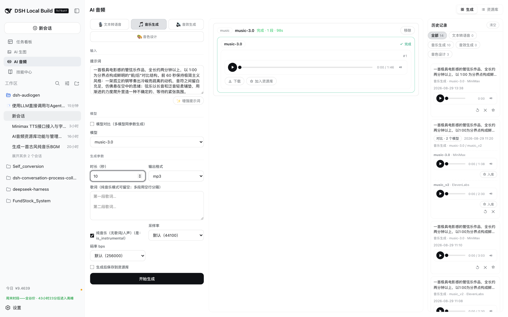
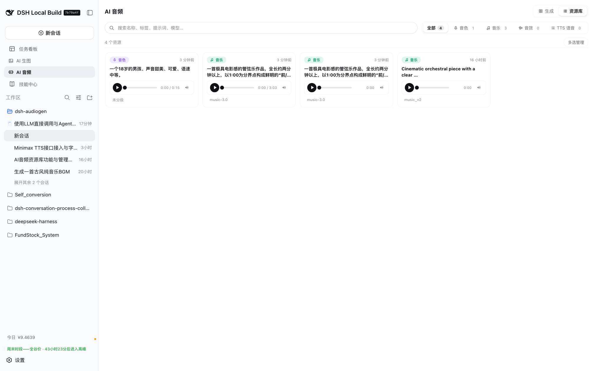
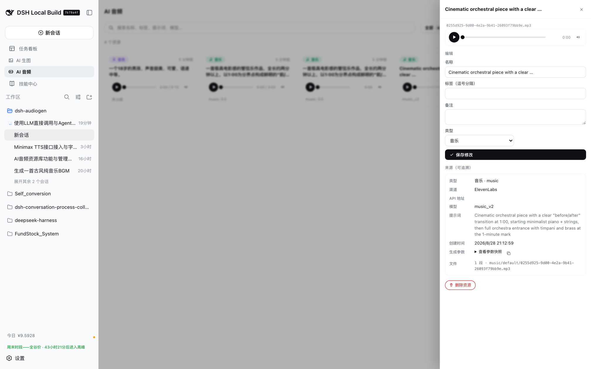
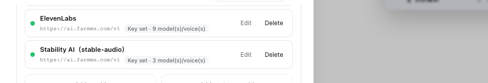
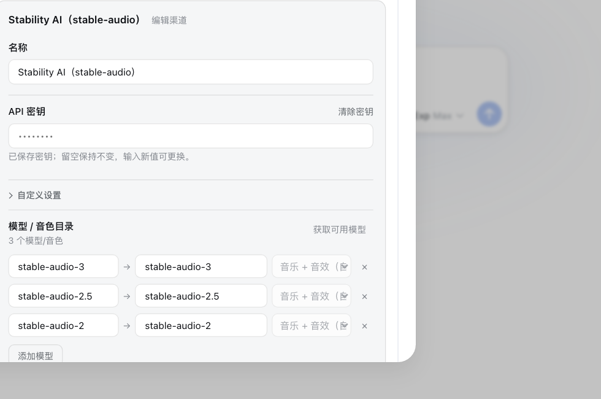
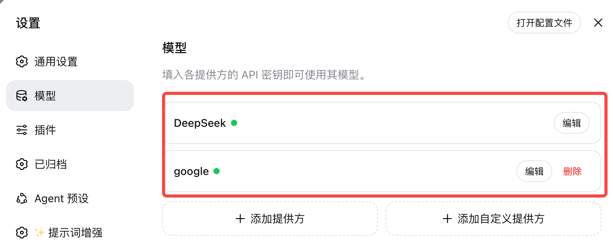

# 🎧 dsh-audiogen

**DeepSeek Harness（DSH）AI 音频插件** —— 让 DSH Web 变成一个音频工作台：文本转语音、音乐生成、音效生成、音色设计，侧边栏面板和 Agent 都能直接用。

[English](README.md) | [简体中文](README.zh-CN.md)




## ✨ 功能特性

- **四种生成模式**：文本转语音（TTS）· 音乐生成 · 音效生成 · 音色设计
- **多厂商渠道统一管理**：OpenAI 兼容 TTS、MiniMax、ElevenLabs、Stability AI，以及任意自定义 OpenAI 兼容 / 通用 POST 接口
- **每渠道模型/音色目录**：一键「获取可用模型」、显示名称（alias）、能力分类（语音/音乐/音效/音色设计），按模型展示完整参数（时长、seed、steps、cfg_scale、loop、提示词影响度，ElevenLabs 音效输出格式拆为「格式/采样率/码率」三个参数、由引擎组合为 `output_format`……）
- **模型对比**：同一提示词并发生成 2–4 个模型，支持每模型参数覆盖，结果按模型分组并列对比
- **✨ 提示词增强**：把一句粗略想法扩写成适合生成模型的完整描述，LLM 模型可在「设置 → 模型」中任选（缺省跟随 Agent 默认模型，无需额外 API Key）
- **历史记录一键恢复**：prompt、配置、模型组合**以及当时的音频**全部回到面板——可直接试听/下载，无需重新生成、不额外消耗
- **资源库**：生成后可一键入库（或设置自动保存），按类型分目录——音色 voice / 音乐 music / 音效 sfx / TTS——支持搜索、标签、重命名、移动分类，并保留完整溯源（渠道、模型、voiceId、提示词、参数快照）。同款音色/配乐/音效直接复用，不必重复生成
- **Agent 工具**：`generate_audio`、`search_audio_library` 与 `manage_audio_voices`（厂商音色浏览/删除 + 按需求描述推荐音色 + **角色音色选角 cast**），并随包分发 TTS/音乐/音效/音色设计/选角会话技能
- **角色音色选角（casting）**：为小说/游戏配音逐角色分配主音色 + 备用音色——`manage_audio_voices` 的 `action=cast` 接收角色画像（JSON 数组/对象或文本整理后的 JSON），按性别/年龄/用途做确定性硬过滤（accent 为偏好、候选为空才放松）返回每角色候选池；Agent 在上下文中全局选角（lead/major 主音色不复用）后 `action=save_cast` 校验 voice_id 属于候选池、自动补齐备份、标记复用警告并持久化到 `~/.dsh/dsh-audiogen/cast-selections.json`，随后按选定 `voice_id` 生成 TTS（也可先用 `generate_audio(mode=voice_design)` 为角色创作专属音色）
- **面板音色管理**：生成页左侧模式栏新增「音色」入口（与 TTS/音乐/音效/音色设计并列）— 浏览/筛选厂商音色（语言/关键词/来源 + ElevenLabs 官方共享库筛选）、按需求描述让 Agent 默认模型推荐音色（如「清亮甜美的少女音」）、试听、删除账户自建音色（需确认）、一键把选定 `voice_id` 回填到 TTS 表单；**每次 AI 推荐自动记录**（最近 50 条，面板与 Agent 共用），可随时回看需求/渠道/推荐理由并直接复用
- **密钥留在本机**：API 密钥存于本地 DSH 设置文档，生成请求由本地宿主代理转发，浏览器与 Agent 全程不接触明文密钥

## 📸 截图

| 生成面板 | 资源库 |
| --- | --- |
|  |  |

| 资源库详情（完整溯源） | 渠道设置 |
| --- | --- |
|  |  |

| 渠道编辑（模型目录与自动能力识别） | LLM 模型（设置 → 模型） |
| --- | --- |
|  |  |

## 📦 安装

插件已发布到 npm，需要 DSH 宿主（Node ≥ 20）：

```bash
dsh plugin --profile web add dsh-audiogen
```

本地开发安装：

```bash
dsh plugin --profile web add /path/to/dsh-audiogen
```

安装后重启 `dsh web`，侧边栏出现 **AI 音频**。

## 🚀 快速开始

1. 打开 **设置 → 插件 → AI 音频**
2. 添加渠道：选择预置提供方（+ 添加提供方）或自定义端点（+ 添加自定义提供方）
3. 填写 API 地址、API 密钥与模型/音色目录（可用「获取可用模型」一键导入）
4. 保存后打开侧边栏 **AI 音频** 面板：
   - 选择模式（文本转语音 / 音乐生成 / 音效生成 / 音色设计）
   - 输入文本或提示词（可选：✨ 增强提示词）
   - 选择模型；或勾选「模型对比」一次生成 2–4 个模型
   - 点击 **开始生成**，试听、下载，或一键加入资源库

## 🎛 各厂商支持的模式

| 模式 | MiniMax | ElevenLabs | Stability AI | OpenAI 兼容 / 自定义 |
| --- | --- | --- | --- | --- |
| TTS | ✅（8 种音色） | ✅（音色 + 流式） | — | ✅ |
| 音乐 | ✅（`music-3.0` / `music-2.6` / `music-cover`） | ✅（`music_v2`） | ✅（`stable-audio-*`） | ✅（通用 POST） |
| 音效 | — | ✅（`eleven_text_to_sound_v2`，loop / prompt_influence / 输出格式 格式+采样率+码率 → `output_format`） | ✅（`stable-audio-*`，同一 text-to-audio 协议，自动识别为音乐+音效双模式） | ✅（通用 POST） |
| 音色设计 | ✅（`/v1/voice_design`） | ✅（`/v1/text-to-voice/design`） | — | — |

## 🤖 Agent 使用

| 工具 | 用途 |
| --- | --- |
| `generate_audio` | 提交 TTS / 音乐 / 音效 / 音色设计任务，等待完成后返回同源音频 URL；支持 `enhance_prompt`、`save_to_library` 与各厂商参数。 |
| `manage_audio_voices` | 浏览/筛选厂商音色库（MiniMax、ElevenLabs，支持语言/关键词/来源筛选）；按需求描述推荐音色（`action=recommend`，复用 Agent 默认模型，返回音色 + 推荐理由，voice_id 校验为候选池真实成员）；**角色选角**（`action=cast` 传角色画像 → 按性别/年龄/用途硬过滤出每角色候选池，`action=save_cast` 校验落盘）；删除账户自有音色（官方/共享/系统音色只读并拒绝）；随后把返回的 `voice_id` 交给 `generate_audio`（mode=tts）即可生成。 |
| `search_audio_library` | 检索本地资源库（类型/分类/关键词），复用已有音色、配乐或音效。 |

会话内常用指令（插件自带技能）：

```text
/audio:tts 用温暖的声音朗读这句话
/audio:music 生成一段 30 秒的 Lo-fi 背景音乐
/audio:sfx 生成一声科幻风格的 UI 提示音
/audio:design 一个温暖复古的合成器音色
```

## 🔐 安全与数据说明

- API 密钥存于本地 DSH 设置文档；生成请求由本地宿主代理转发（`/api/dsh-audiogen/*`，仅回环地址可访问）
- 生成会消耗上游 API 额度；音频内容由上游模型生成
- 历史与资源库持久化在 `~/.dsh/dsh-audiogen/`
- 提示词增强使用所选 LLM 模型（默认跟随 Agent 默认模型），无需额外 API Key

## 🛠 开发

```bash
pnpm install
pnpm run typecheck
pnpm run build      # 输出 lib/（宿主 + 浏览器 bundle）
```

## 📄 许可证

[Apache-2.0](LICENSE)
